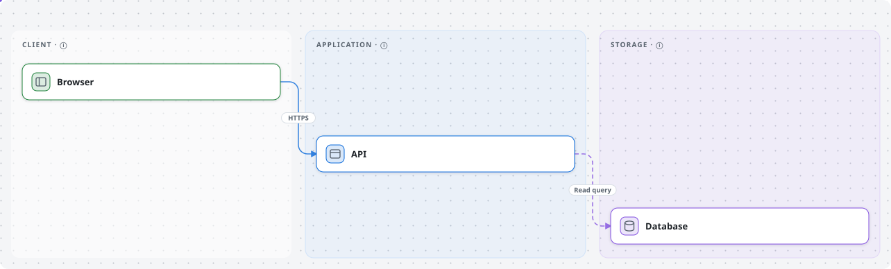

# Archloom

[](https://www.npmjs.com/package/@chtah/archloom)
[](https://github.com/chtah/archloom/actions/workflows/ci.yml)
[](https://scorecard.dev/viewer/?uri=github.com/chtah/archloom)
[](LICENSE)

Let your coding agent draw the architecture of your codebase, and keep the
drawing current as the code changes.

Agents write code faster than people can follow how the system fits together.
Archloom gives the agent a skill for reading a codebase and a small JSON format
for what it finds, and turns that into diagrams a person can read in a README, a
comment or an interactive canvas.

<picture>
  <source media="(prefers-color-scheme: dark)" srcset="examples/architecture.dark.svg">
  
</picture>

- **A skill, not a service.** The agent you already use reads the code. Archloom
  calls no model, uploads nothing and has no backend.
- **A graph you can review.** The source is one `*.archloom.json` file in your
  repository. Changes to the architecture show up as a diff.
- **Images for where people read.** Light and dark SVGs with a snippet for
  Markdown files and comments, and an offline HTML canvas with pan, zoom, detail
  popups and step-by-step data flow.
- **Deterministic output.** The same graph gives the same SVG bytes, so CI can
  tell when a committed image is out of date.

## Use it with an agent

Install the CLI in your project and the skill in your agent:

```bash
npm install --save-dev @chtah/archloom
npx skills add chtah/archloom --skill archloom
```

Or copy [`skills/archloom/`](skills/archloom/) into your agent's skill directory.
Then ask:

> Draw the architecture of this repository with Archloom, with a data-flow
> diagram for the main request.

The agent reads what declares and runs your system, writes
`docs/architecture/<name>.archloom.json`, and generates:

| File | Use |
| --- | --- |
| `docs/architecture/<name>.archloom.json` | The source. Commit it. |
| `docs/architecture/<view>.light.svg`, `<view>.dark.svg` | Images to embed. Commit them. |
| `.archloom/<name>/index.html` | Interactive canvas for looking around. Local only. |

It reports which file shows each component and connection, and what it left out
and why. Before the first commit it shows you every label and summary, because a
committed graph is published with everything in it.

When the architecture changes, ask the agent to bring the diagram up to date. It
edits the same graph and keeps the IDs, so the diff shows what changed. The skill
offers one line for your `AGENTS.md` so agents do this as part of the change, and
a check for CI:

```bash
npx archloom markdown docs/architecture/<name>.archloom.json --check
```

The check fails when the committed SVGs differ from a fresh render. It cannot
know whether the graph still matches the code; that stays a review question.

How well does the skill read code? [`evals/`](evals/) holds small fixture
codebases with answer keys, a grader that uses no model, and the results of each
run. Read the limits there before relying on a number.

## What you get

A data-flow view of the same example:

<picture>
  <source media="(prefers-color-scheme: dark)" srcset="examples/flow-load-records.dark.svg">
  
</picture>

And the offline canvas, opened from a file with no server:


Both images above come from [`examples/web-system.archloom.json`](examples/web-system.archloom.json)
with `archloom markdown`; see [diagrams in Markdown and comments](docs/markdown.md).

## Use it without an agent

Archloom is also a plain ESM library and CLI. Requires Node.js 20.11 or newer.

```bash
npm install @chtah/archloom
```

Describe a system in `graph.json`:

```json
{
  "title": "Example system",
  "lanes": [{ "id": "app", "label": "Application" }],
  "nodes": [
    { "id": "api", "label": "API", "lane": "app", "summary": "Handles requests." },
    { "id": "db", "label": "Database", "lane": "app", "kind": "datastore" }
  ],
  "edges": [{ "id": "query", "from": "api", "to": "db", "kind": "data", "label": "Query" }]
}
```

```bash
npx archloom validate graph.json
npx archloom markdown graph.json --out docs/architecture   # light and dark SVGs, prints a snippet
npx archloom render graph.json --out .archloom/system      # SVGs, atlas.json and index.html
```

The full format is in the [graph reference](skills/archloom/references/graph.md)
and the [JSON Schema](schema/graph.schema.json).

```js
import { parseGraph, render, renderMarkdown, renderHtml } from '@chtah/archloom';

const graph = parseGraph(JSON.parse(json)); // throws ArchloomError on invalid input
const { svg } = render(graph, { lens: 'architecture', theme: 'dark' });
const images = renderMarkdown(graph, { base: 'docs/architecture' });
const html = renderHtml(graph); // the self-contained canvas
```

| Topic | Where |
| --- | --- |
| Functions, options and atlas geometry | [API reference](docs/api.md) |
| Embedding the canvas in a web page with `mountCanvas` | [Embedding](docs/embedding.md) |
| Lucide and Simple Icons, and their trademark terms | [Icons](docs/icons.md) |
| SVGs and snippets for Markdown and comments | [Markdown](docs/markdown.md) |

## What Archloom does not do

- **No pull-request integration.** It does not analyse diffs or post comments.
  You or your agent paste the snippet where it belongs.
- **No MCP server.** Agents that can read a codebase already have a shell, so the
  CLI and the skill cover it without another protocol to maintain. Open an issue
  if you have a client where that does not hold.
- **No editor.** The canvas is read-only; the graph file is the thing you edit.

## Privacy

The graph, the HTML canvas and `atlas.json` hold the whole system as written,
including anything a view leaves out. A view is not redaction. Read
[PRIVACY.md](PRIVACY.md) before committing or sharing diagrams of a private
system, and report vulnerabilities through [SECURITY.md](SECURITY.md).

## Contributing

```bash
pnpm install --frozen-lockfile
pnpm verify
```

`pnpm verify` builds, type-checks and runs the unit and browser tests. The browser
tests need a local Chromium-based browser; point `CHROME_BIN` at its executable.
[CONTRIBUTING.md](CONTRIBUTING.md) says which changes need an issue first,
[AGENTS.md](AGENTS.md) has the repository map and implementation rules, and
[docs/releasing.md](docs/releasing.md) the release checklist. Participation is
covered by the [Code of Conduct](CODE_OF_CONDUCT.md).

## Credits and license

[MIT](LICENSE). Archloom derives from [PR Lens](https://github.com/coldteadotai/pr-lens)
by Coldtea AI, which holds the retained copyright, and is maintained independently
without their endorsement. Dependencies and icon assets keep their own terms; see
[THIRD_PARTY_NOTICES.md](THIRD_PARTY_NOTICES.md).
