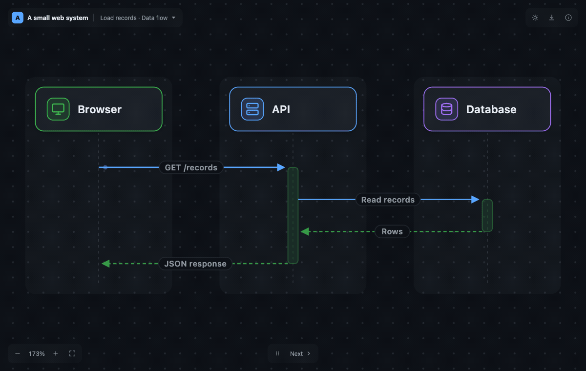

# Archloom

[](https://www.npmjs.com/package/@chtah/archloom)
[](https://github.com/chtah/archloom/actions/workflows/ci.yml)
[](https://scorecard.dev/viewer/?uri=github.com/chtah/archloom)
[](LICENSE)

Architecture and data-flow diagrams from JSON, with an offline interactive canvas.



- **Architecture diagrams** with lanes, component cards and connecting edges.
- **Data-flow diagrams** with ordered sync, async, return and self messages.
- **Deterministic, self-contained SVGs** in light and dark themes.
- **An offline HTML canvas** with pan, zoom, detail popups, message stepping and SVG download.
- **No backend.** Nothing is uploaded, and no model provider or hosted service is involved.

## Install

```bash
npm install @chtah/archloom
```

Requires Node.js 20.11 or newer. The package is ESM only.

## Quick start

Describe a system in `graph.json`:

```json
{
  "title": "Example system",
  "lanes": [{ "id": "app", "label": "Application" }],
  "nodes": [
    { "id": "api", "label": "API", "lane": "app", "summary": "Handles requests." },
    { "id": "db", "label": "Database", "lane": "app", "kind": "datastore" }
  ],
  "edges": [{ "id": "query", "from": "api", "to": "db", "kind": "data", "label": "Query" }]
}
```

```bash
npx archloom validate graph.json
npx archloom render graph.json --out diagrams
```

Open `diagrams/index.html` in a browser; no server is needed. The directory also
holds one SVG per view and `atlas.json`. Options: `--theme dark|light`,
`--icons lucide|simple-icons|both`, `--force`.

The full format is in the [graph reference](skills/archloom/references/graph.md)
and the [JSON Schema](schema/graph.schema.json). A larger example lives in
[`examples/`](examples/web-system.archloom.json).

## Library

```js
import { parseGraph, render, renderHtml } from '@chtah/archloom';

const graph = parseGraph(JSON.parse(json)); // throws ArchloomError on invalid input
const { svg } = render(graph, { lens: 'architecture', theme: 'dark' });
const html = renderHtml(graph); // the self-contained canvas
```

| Export | Purpose |
| --- | --- |
| `parseGraph(input)` | Validate input and return a graph with defaults applied. |
| `render(input, options?)` | Render one diagram to SVG. |
| `renderAll(input, options?)` | Render every view. |
| `renderHtml(input, options?)` | Return the offline canvas as one HTML string. |
| `ArchloomError` | Error with a stable `code` and validation `issues`. |

See the [API reference](docs/api.md) for options, diagram fields and atlas geometry.

## Embed the canvas

```js
import { mountCanvas } from '@chtah/archloom/browser';

const canvas = mountCanvas(document.getElementById('diagram'), graph, { theme: 'dark' });
canvas.update(graph, { theme: 'light' });
canvas.destroy();
```

The container needs a definite CSS height. The canvas runs in a sandboxed iframe;
see [embedding](docs/embedding.md).

## Icons

Default glyphs need no extra package. For [Lucide](https://lucide.dev) or
[Simple Icons](https://simpleicons.org), install the peer (`npm install lucide`),
set keys such as `lucide:server` or `si:postgresql` on nodes, and render with
`--icons lucide`. Brand icons carry trademark terms of their own; read
[icons](docs/icons.md) before publishing them.

## Agent skill

[`skills/archloom/`](skills/archloom/) teaches coding agents to write and render
graphs. Copy the directory into your agent's skill directory, or run
`npx skills add chtah/archloom --skill archloom`.

## Privacy

The HTML canvas and `atlas.json` embed the whole graph, including entities left
out of named views. A view is not redaction; read [PRIVACY.md](PRIVACY.md) before
sharing generated files. Report vulnerabilities through [SECURITY.md](SECURITY.md).

## Contributing

```bash
pnpm install --frozen-lockfile
pnpm verify
```

`pnpm verify` builds, type-checks and runs the unit and browser tests. The browser
tests need a local Chromium-based browser; point `CHROME_BIN` at its executable.
[AGENTS.md](AGENTS.md) has the repository map and contribution rules, and
[docs/releasing.md](docs/releasing.md) the release checklist.

## Credits and license

[MIT](LICENSE). Archloom derives from [PR Lens](https://github.com/coldteadotai/pr-lens)
by Coldtea AI, which holds the retained copyright, and is maintained independently
without their endorsement. Dependencies and icon assets keep their own terms; see
[THIRD_PARTY_NOTICES.md](THIRD_PARTY_NOTICES.md).
